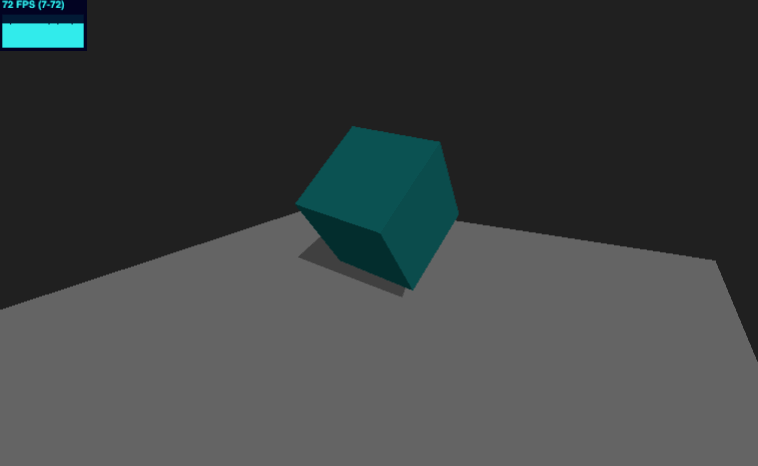

# 🎨 create-three-demo

An **unofficial** [Vite](https://vitejs.dev/) + [Three.js](https://threejs.org/) starter template for quickly experimenting with 3D scenes, shaders, and ideas.

This template provides a clean, modern dev environment with:

- **[Vite](https://vitejs.dev/)** – fast dev server with HMR, optimized builds
- **TypeScript** – preconfigured, with a sensible default config
- **[vite-plugin-glsl](https://www.npmjs.com/package/vite-plugin-glsl)** – import `.glsl, .vs, .fs, .vert, .frag` shader files directly with live reload
- **[vite-plugin-restart](https://www.npmjs.com/package/vite-plugin-restart)** – automatically restart the dev server when config files change

And some helpful inclusions and Three.js utilities:

- **Camera helpers** – full-screen perspective/orthographic cameras with auto-resize to fit browser
- **Scene setup helper** – quickly get a scene, renderer, resize handling, and optional OrbitControls
- **ShaderCanvas** – full-screen quad with built-in uniforms (`uTime`, `uResolution`, `uMouse`)
- **[Stats.js](https://github.com/mrdoob/stats.js) helper** – optional FPS panel for performance debugging
- **[lil-gui](https://github.com/georgealways/lil-gui)** – lightweight debug GUI for tweaking uniforms, material parameters, and scene settings in real time

## 🖼 Starting Example

Inside `src/examples/`, you’ll find multiple starting points:

<p align="center">
  
  
  
</p>

- `sceneExampleBasic.ts` – Simple lit cube casting shadows on a plane

- `sceneExample.ts` – Plane with custom vertex + fragment shader

- `shaderExample.ts` – ShaderCanvas using a simple fragment shader that uses the `uTime` and `uMouse` uniforms

---

## 🚀 Getting Started

```bash
npm create three-demo@latest my-project
cd my-project
pnpm install # or npm install
pnpm dev
```

Pick a starting demo by editing `src/main.ts`:

```javascript
// src/main.ts
import "./examples/sceneExampleBasic";
// import "./examples/sceneExample"
// import "./examples/shaderExample"
```

Once you pick one, you can delete the `examples/` folder and start fresh.

## 🌐 Deployment

Deploy to Vercel

Push your project to GitHub.

Go to [vercel.com/new](https://vercel.com/new).

Import your repo and click Deploy.

> Note: This template is unofficial and not maintained by the Three.js or Vite teams. It’s meant as a quick-start kit for personal projects, shader experiments, and prototyping.
